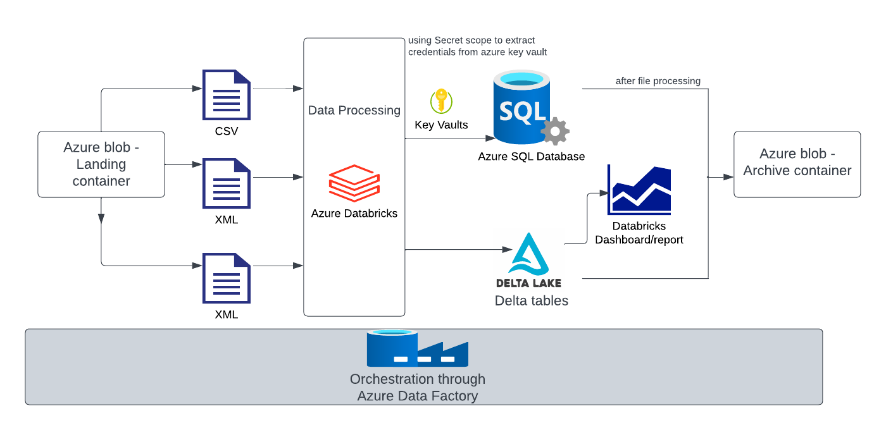
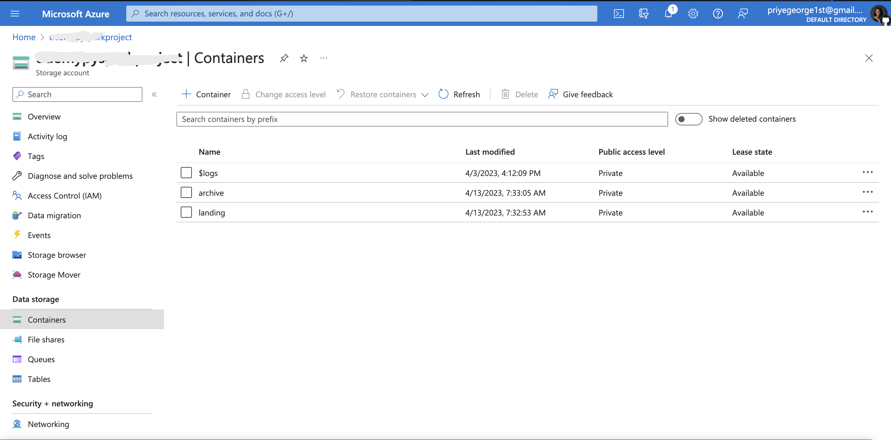
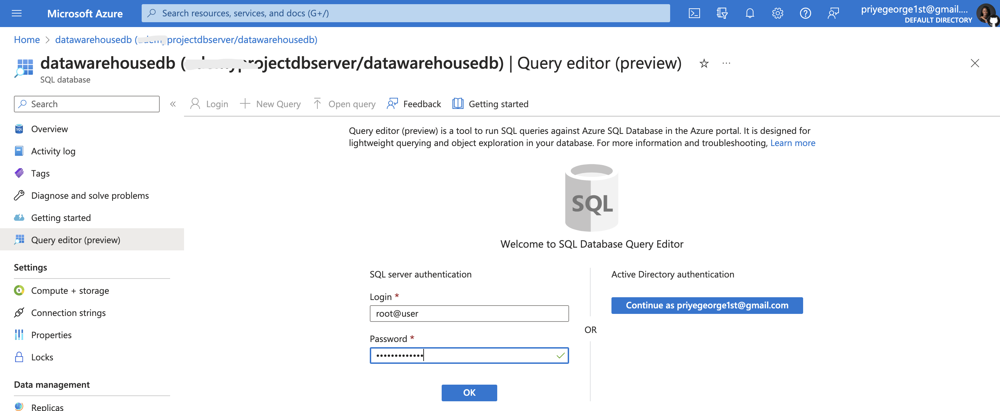
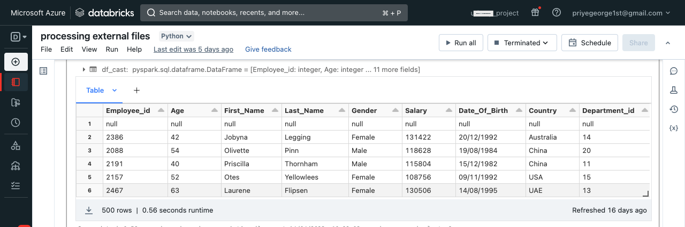
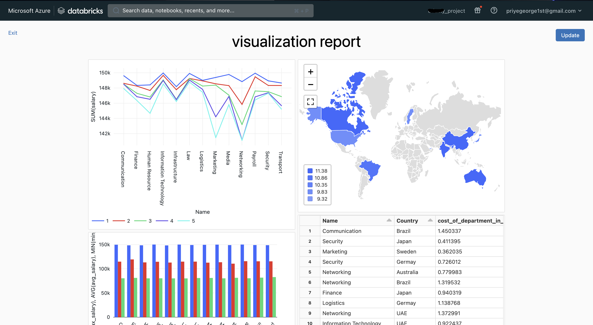
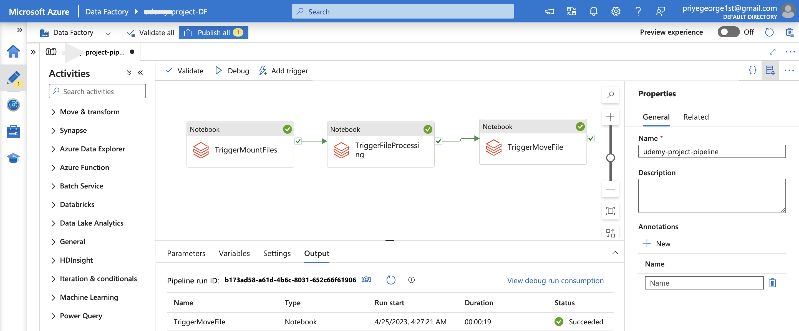

# Creating Azure Data Pipeline
This project focuses on utilizing Azure Cloud Services for Data Ochestration. 

It involves use of the following azure services:
- Azure Databrics
- Azure Storage account
- Azure Keyvault
- Azure SQL
- Azure Data Factory

## Architecture

### Languages used
- Python
- Scala (minority)
- SQL

### Dataset Used
You can use any dataset, we are mainly interested in operation side of Data Engineering (building data pipeline)
However, dataset can be found here - <github dataset link>

## Getting started 
#### NOTE: The Descriptions for creating the required Azure services will be highlighted in links gotten from Azure documentations.
1. Start by <a href="https://azure.microsoft.com/en-us/free/">creating an Azure account</a> with $200 free credits for beginners to play around with. Note that you will have 30days to use it, in addition to other free services  

2. Log in to your newly created Azure portal and click on the 'Create a resource' button. This enables you to create any required Azure service. 
    a. Search for  Azure Databricks and follow <a href=https://learn.microsoft.com/en-us/azure/databricks/getting-started/#use-the-portal-to-create-an-azure-databricks-workspace>these instructions</a> to set up your Azure Databricks instance. 

    b.  After Databricks instance have been created and deployed, <b>go to resources</b> and then <b>Launch Workspace</b> to be redirected to your Databricks workspace  

    c. Create Cluster on Databricks to run spark jobs
        To create clusters, navigate to the menu side bar, click on 'Compute' and then 'Create Compute'. 
        - Enter your desired cluster name 
        - Choose single node for the purpose of this project and leave other default congifurations. 
        - Click on create cluster. 

    d. Create Notebook to process external files using Pyspark. 
        - Navigate to the menu on the sidebar 
        - CLick on <b>workspace</b>, create new folder if you wish 
        - Create Notebook and choose scala as the language to be used. 

3. <a href="https://learn.microsoft.com/en-us/azure/storage/common/storage-account-create?tabs=azure-portal#create-a-storage-account-1">Create Azure Storage account </a>to hold datasets. Make sure to use the resource group created above for this, and every other services to be created. 
    a. Navigate to <b>Containers</b> on the side bar of the newly created storage account 
    b. Click the <b>+</b> sign to create a container(folder). In this case we will be creating two containers - <b>landing</b>  and <b>archive</b> 
    c. Click on the <b>landing</b> folder and upload files to the cotainer using the <b>upload</b> button  
    d. our storage account should look like the image below 

4. <a href="https://learn.microsoft.com/en-us/azure/azure-sql/database/single-database-create-quickstart?view=azuresql&tabs=azure-portal#create-a-single-database">Spin up Azure SQL and create Database</a>. 
    a. Make sure to use the same recourse group in all services 
    b. Also create a new server and store the password and username details 
    c. Make sure to click <b>yes</b> under Allow Azure Service and resources to access this server 
    d. After deploying Azure SQL, Open resource, Navigate to sidebar and click on <b>connection string</b> 
    e. Click on <b>JDBC</b> and copy the displayed string. Paste somewhere as this will be used later   
    f. Confirm creation of database by clicking the query tool  
    

5. <a href="https://learn.microsoft.com/en-us/azure/key-vault/general/quick-create-portal#create-a-vault">Create Azure Keyvault </a>then <a href="https://learn.microsoft.com/en-us/azure/key-vault/secrets/quick-create-portal#add-a-secret-to-key-vault"> add secrets to created keyvault</a> to hold Database login details, and then <a href="https://learn.microsoft.com/en-us/azure/key-vault/general/quick-create-portal#create-a-vault"> create Secret scope on Databricks </a>to enable databricks instace access the keyvault service created on azure portal

6. Processing Data on Azure Databricks
For this stage, please find the attached files with sql, python and scala code 
    a. Upload the `mount.scala` file to your databricks instance to Mount containers from azure to databricks. This gives you access to the files stored in Azure blob storage. make sure to replace the `sas` variable with your newly generated <a href="https://learn.microsoft.com/en-us/azure/cognitive-services/translator/document-translation/how-to-guides/create-sas-tokens?tabs=Containers#create-sas-tokens-in-the-azure-portal">SAS tokens from Azure portal</a> 

    b. To process csv, xml, and json files upload the `process_csv_xml_json.ipynb` notebook to your databricks instance. Confirming the dataframe was properly created should show something like     

7. <a href="https://learn.microsoft.com/en-us/azure/databricks/visualizations/#------create-a-new-visualization">Visualizing Data on Databricks></a>
To visualize data on databricks, upload the `creating_dashboards.sql` file to your instance. our dashboard report should look like     

8. Creating Data Pipeline with Azure Data Factory
In this stage, <a href="https://learn.microsoft.com/en-us/azure/data-factory/tutorial-copy-data-portal#create-a-data-factory">A Data Factory resource was created. </a> This service helps to create data pipelines which can then be published and monitored.
a. next is to create the data pipeline. There will be three tasks that will be created and these tasks will run from our databricks notebooks. 
b. Drag and drop the notebook from the Databricks menu, and make sure to add the notebook path under <b>settings</b> 
our pipeline should look like the this:   
c. From here you can either <a href="https://learn.microsoft.com/en-us/azure/data-factory/tutorial-copy-data-portal#trigger-the-pipeline-manually">trigger the pipeline manually</a> or <a href="https://learn.microsoft.com/en-us/azure/data-factory/tutorial-copy-data-portal#trigger-the-pipeline-on-a-schedule"> trigger the pipeline on a schedule</a>
